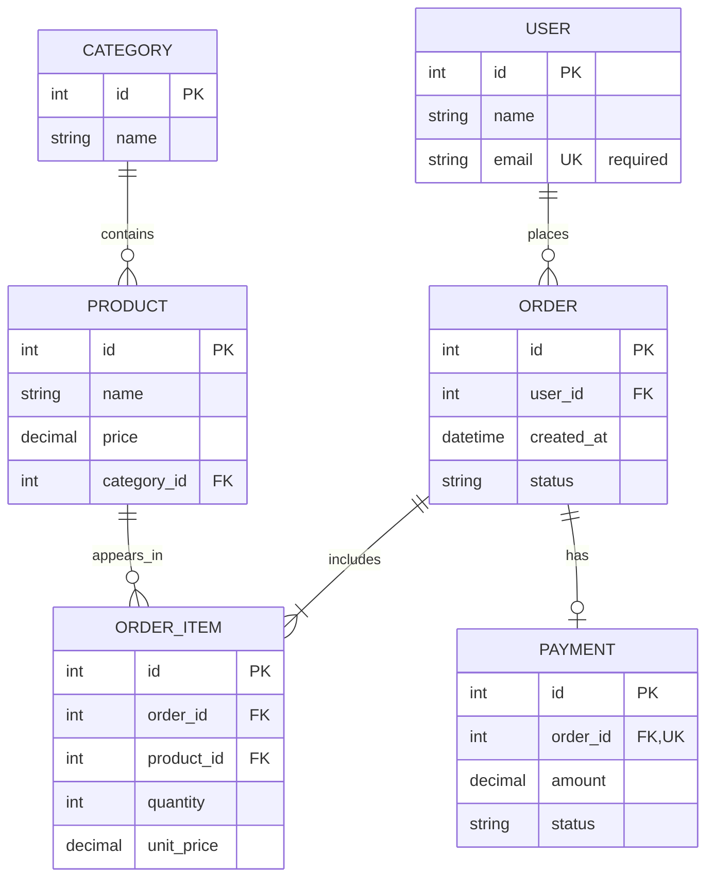

# ER-діаграма онлайн-магазину

```mermaid
erDiagram
    USER {
        int id PK
        string name
        string email UK "required"
    }

    CATEGORY {
        int id PK
        string name
    }

    PRODUCT {
        int id PK
        string name
        decimal price
        int category_id FK
    }

    ORDER {
        int id PK
        int user_id FK
        datetime created_at
        string status
    }

    ORDER_ITEM {
        int id PK
        int order_id FK
        int product_id FK
        int quantity
        decimal unit_price
    }

    PAYMENT {
        int id PK
        int order_id FK,UK
        decimal amount
        string status
    }

    USER ||--o{ ORDER : places
    CATEGORY ||--o{ PRODUCT : contains
    ORDER ||--|{ ORDER_ITEM : includes
    PRODUCT ||--o{ ORDER_ITEM : appears_in
    ORDER ||--o| PAYMENT : has

```
